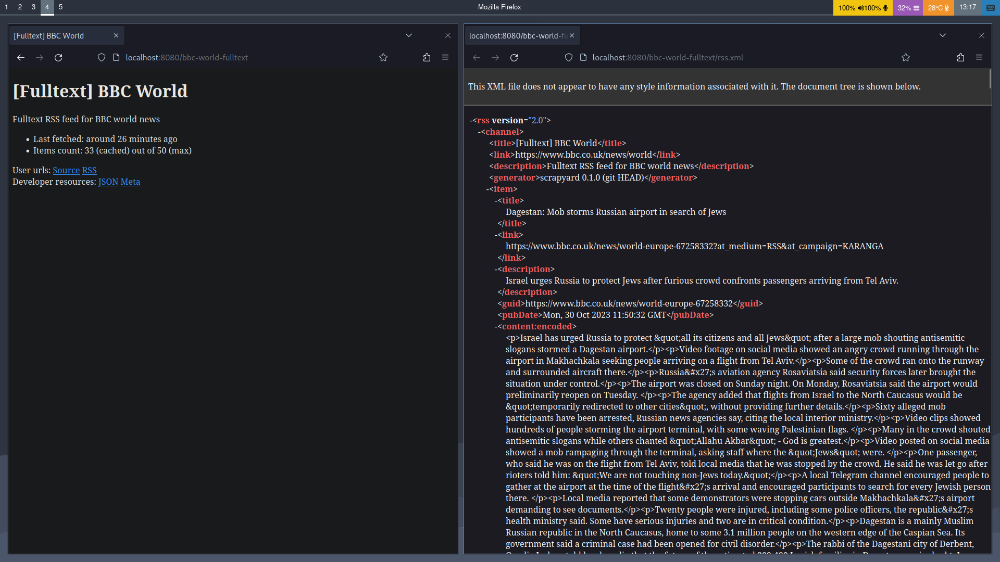

## Overview

Feedscraper is an automatic webscraper and RSS generater.



Install and run with

```sh
$ cargo install --git https://github.com/siriusmart/feedscraper
$ feedscraper
```

By default, going to http://localhost:8080 should present you with a navigatable UI of hyperlinks. You can use my personal instance at https://feeds.siri.sh (powered by rpi w/ debian) if you dont have the hardware to host your own.

### Configuration

Config files can be found in `~/.config/feedscraper` (Linux), `/Users/[Username]/Library/Application/Support/feedscraper` (Mac) or `C:\Users\[Username]\AppData\Roaming\feedscraper` (Windows).

`feedscraper.json` is the server's main config file, here are all the available options.

```json
{
    "http_port": Number?,
    "https": {
        port: Number,
        chain: String, // path to ssl chain, e.g. /etc/letsencrypt/live/yourdomain.com/fullchain.pem
        key: String // path to ssl privkey, e.g. /etc/letsencrypt/live/yourdomain.com/privkey.pem
    }?,
    "show_feed_configs": Boolean
}
```

`http_port` and `https` are optional fields, removing the option will disable the corresponding protocol. `show_feed_configs` when set to false, hides content in `feeds.json`, useful if it includes private information such as API tokens.

`scrapyard.json` and `feeds.json` use the same specs as in [scrapyard](https://github.com/Siriusmart/scrapyard), which is the base crate of this server.

License: AGPL-3.0 (The happy Stallman license)
